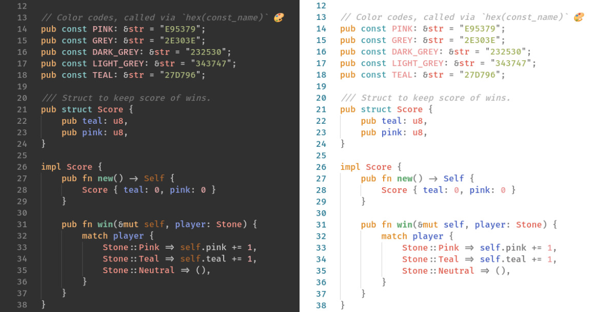

# Populus 🥬

> Populus is a genus of 25–30 species of deciduous flowering plants in the family Salicaceae, native to most of the Northern Hemisphere. English names variously applied to different species include poplar /ˈpɒp.lər/, aspen, and cottonwood. - Wikipedia

Populus is a Dual VS-Code Theme trying to blend in very well with the respective Pop!_OS themes.

### Installation ⬇️

The theme is readily available to download [here](https://marketplace.visualstudio.com/items?itemName=tmpr.populus).

### Tribute 🗽
Of course, this theme just heavily leans on the GTK-theme of Pop!_OS by [System76](https://system76.com/). Most of the color-picking was done by them, so check them out! 🤗

### Other Pop!-inspired Themes 💕

If this Pop!-theme does not fit one's taste, there are others which might do better:

- [Pop Theme](https://marketplace.visualstudio.com/items?itemName=ArtisanByteCrafter.poptheme)
- [pop-theme](https://marketplace.visualstudio.com/items?itemName=orenan.pop-theme)

### Contribute 🤝

So far, this is still in "development" and will only get better over time. If you find something that is inconsistent, feel free to either open an issue or fix it yourself. 